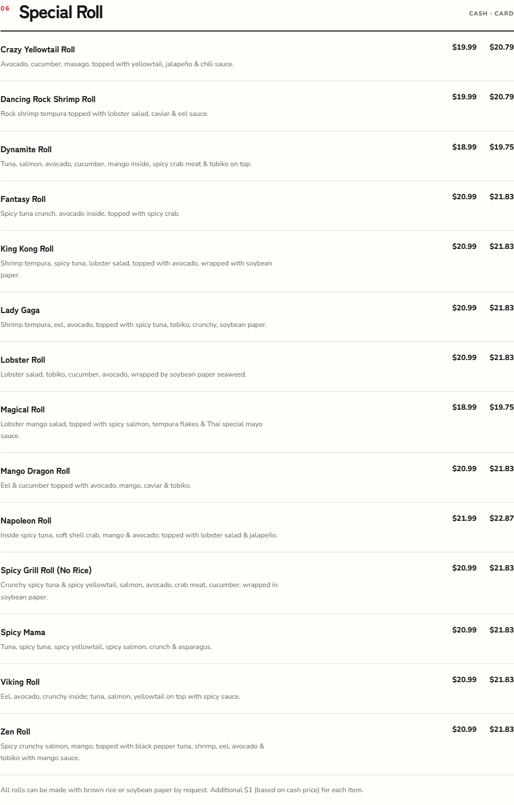
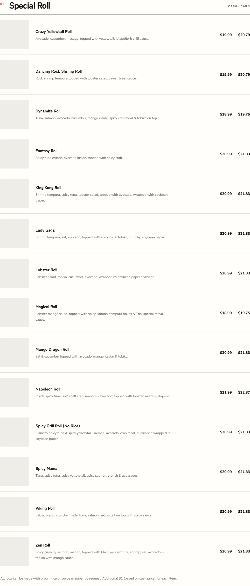
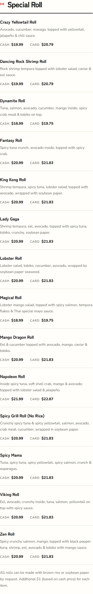
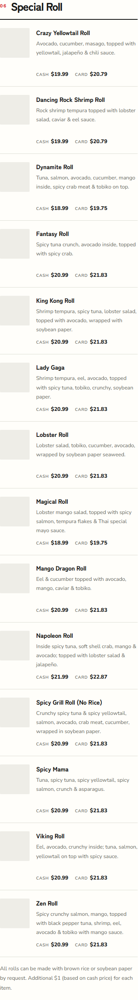

# Menu photo layout review

Each menu row now reserves a square, text-free warm gray photo slot, with the dish name/description beside it. Desktop price columns retain their original right edge; mobile prices remain below the description. Rows have equal heights within each category and consistent vertical padding.

| View | Before | After |
| --- | --- | --- |
| Desktop (1440px) |  |  |
| Mobile (390px) |  |  |

Screenshots isolate Special Roll, hiding fixed navigation for capture. Existing featured dish photos elsewhere on the menu are retained. All new row photo slots are initially blank, as requested.

## Adding photos later

Place each approved image in `public/images/menu/`, named after the existing item ID. For example, `dinner-5-0.webp` supplies Crazy Yellowtail Roll. The static build discovers the file automatically; there is no menu-data or JSX edit. Replace the same filename to change the image, or remove it to restore the placeholder after rebuilding. Supported formats: WebP, JPG, JPEG, PNG, AVIF. Duplicate files for one ID fail the build rather than select the wrong photo.

See the [complete filename index](../../menu-photo-index.md) and [upload instructions](../../../public/images/menu/README.md). Thumbnails crop to square; the enlarged view preserves the original photo proportions. Missing photos are noninteractive and generate no failed image requests.

## Validation

- Production build, TypeScript and all 9 Playwright tests passed.
- New layout coverage checks 320/390/768/1440px across Dinner, Lunch and Happy Hour: square slots, uniform category row heights, spacing, price alignment, and no page overflow.
- Desktop Special Roll price bounds at 1440px were unchanged: left 1226.39px, width 120px.
- A temporary, correctly matched Tonkotsu photo verified build-time discovery; keyboard/click zoom; modal focus; Escape, close-button and backdrop dismissal; focus restoration; and failed-image fallback. The fixture was removed and the final blank version rebuilt.
- To repeat the image interaction check locally: temporarily copy `public/images/shot-dish-tonkotsu.webp` to `public/images/menu/dinner-13-2.webp`, run `npm run build`, start `npm run preview` on port 3001, then run `node scripts/check-menu-photo.mjs`. Remove **only that temporary file** and rebuild before committing. Do not overwrite a real existing image at that path.
- ESLint: no errors; 2 pre-existing warnings in HomeFilm.tsx / IgReels.tsx.
- SEO metadata, alt and page checks passed. The existing mapping checker reports Windows CRLF fixture failures; a read-only check against the original Git fixtures passes (100% click preservation). No SEO files were changed.

`vercel.json`, `seo/`, `content/menus.json`, and `app/layout.tsx` remain unchanged. Await Jaye's review; do not merge automatically.
