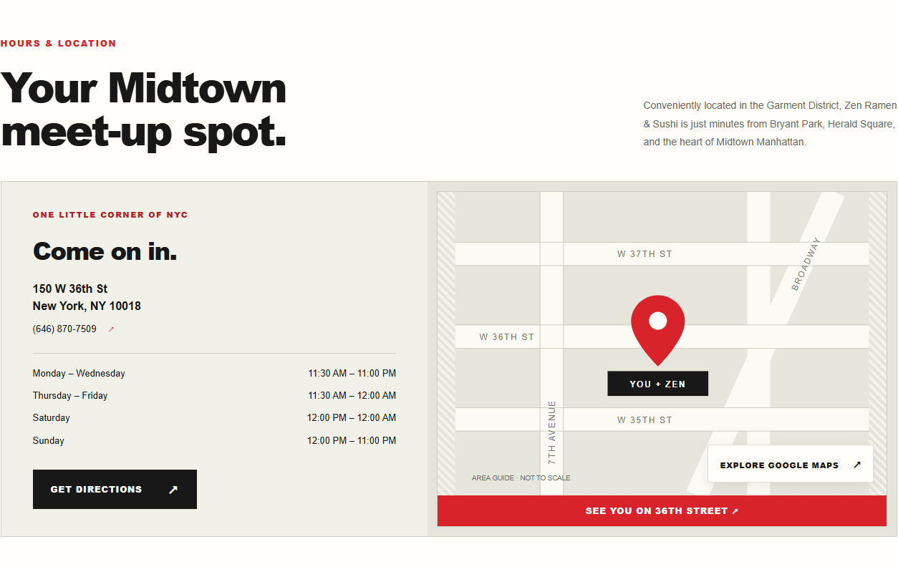
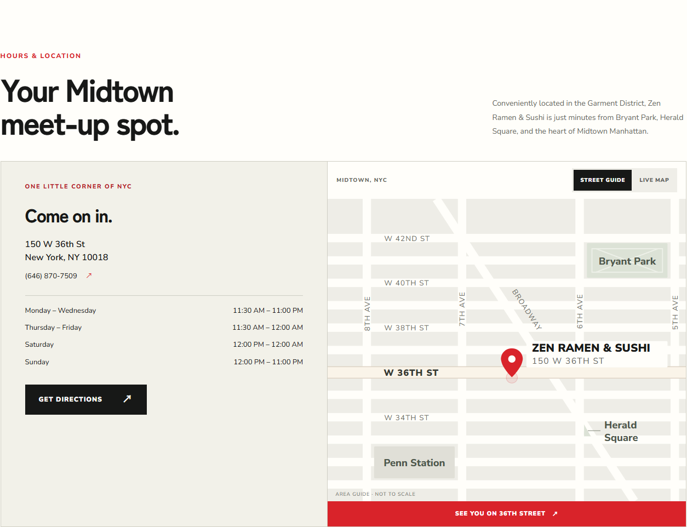
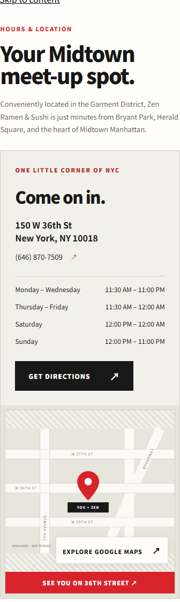
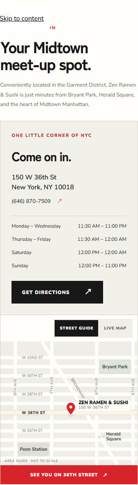

# Midtown map review

The home page street guide now fills the map area without the inset striped frame. A finer street grid highlights W 36th St, adds Bryant Park / Penn Station / Herald Square, and places a smaller red pin beside the restaurant name and address. STREET GUIDE and LIVE MAP switch in both directions, with Google Maps loaded only on request.

| View | Before | After |
| --- | --- | --- |
| Desktop (1440px) |  |  |
| Mobile (390px) |  |  |

Screenshots isolate the location section; fixed navigation and the mobile action bar are hidden for capture. Before images use the original component and stylesheet from the base commit. The guide is illustrative, not to scale; the pin identifies the south side of W 36th between Seventh Avenue and Broadway. The existing Google Maps destination and directions URL are retained.

Validation:

- Production build and TypeScript check passed.
- All 8 Playwright tests passed, including keyboard map switching and stable card height at 390, 768, and 1440px; the map provider is stubbed in this repeatable test.
- Existing responsive checks cover 360, 768, and 1440px across all tested routes.
- ESLint: no errors; 2 existing warnings in HomeFilm.tsx and IgReels.tsx.
- SEO metadata, image alt text, and page checks passed. The mapping checker prints 22 failures with Windows CRLF fixtures; reading the original Git fixtures in memory instead passes with 100% click preservation. No SEO fixtures or scripts were changed. Linux CI remains the authoritative repository check.

Protected files (`vercel.json`, `seo/`, `content/menus.json`, `app/layout.tsx`) are unchanged. Jaye should review the PR preview before any merge.
